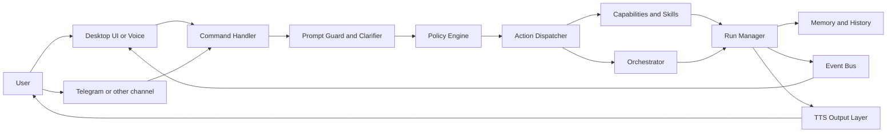
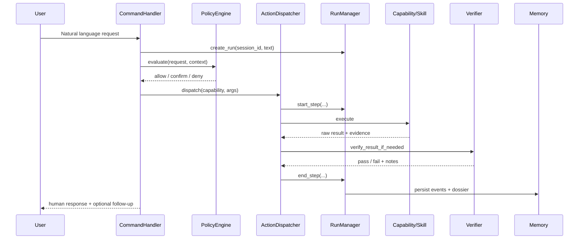
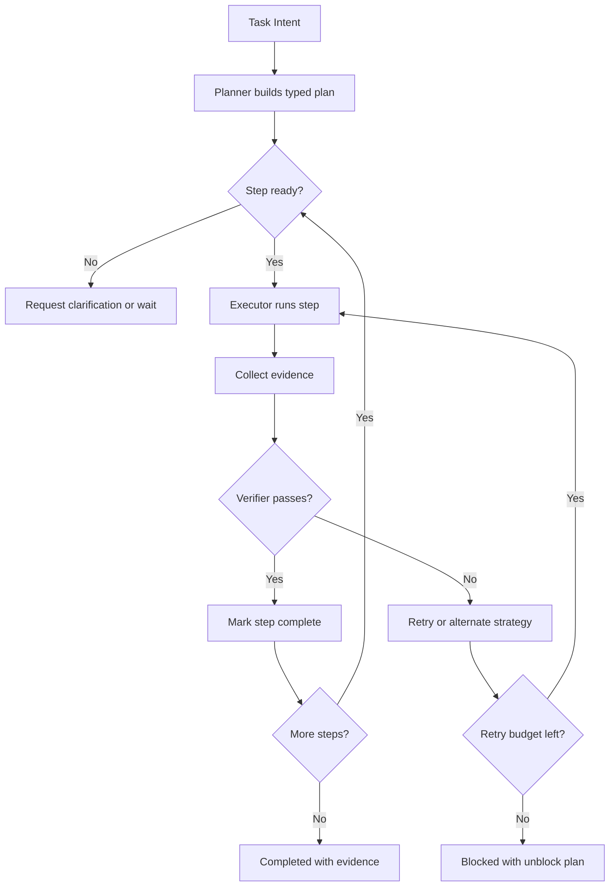
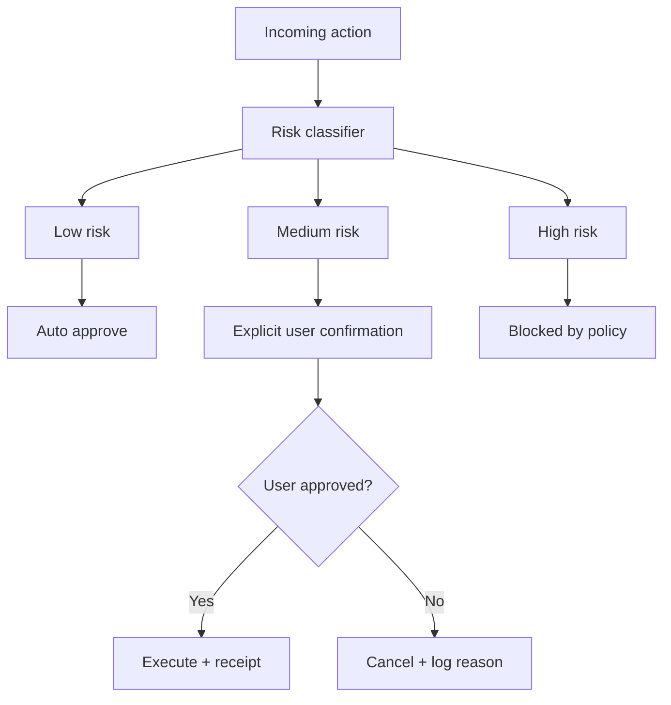
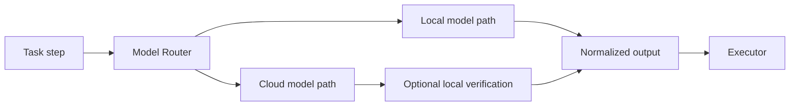
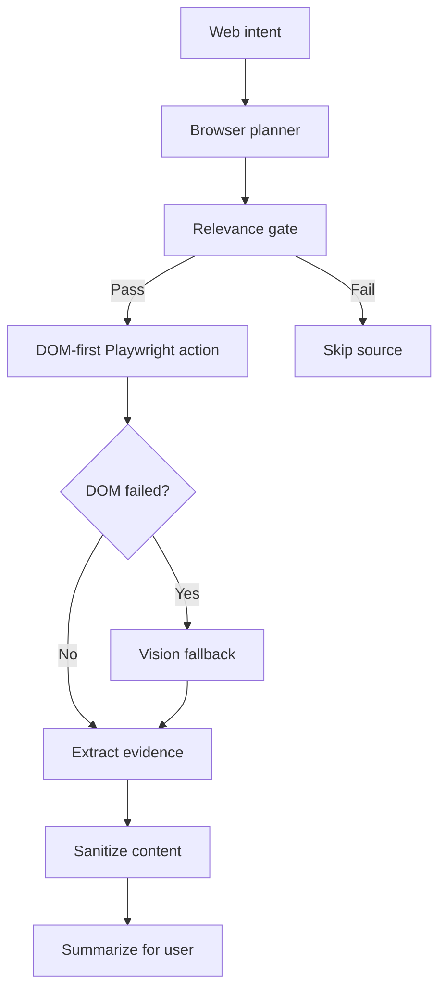
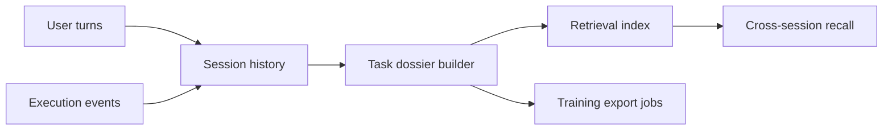

# Chintu AI Architecture

This document is the engineering architecture reference for Chintu.
It explains how requests are processed, how safety is enforced, and how results are verified.

## 1) System Context

## 2) Request Lifecycle

## 3) Planner-Executor-Verifier Loop

For multi-step work, Chintu runs a plan loop rather than one-shot execution.

## 4) Safety and Approval Control

Hard policies:
- No payment or checkout actions.
- Destructive file/system actions require explicit confirmation.
- Account publish/send actions require explicit confirmation.
- Protected paths cannot be modified without policy permit.

## 5) Model Orchestration

Routing signals:
- task type (chat, code, vision, planning, extraction)
- privacy sensitivity
- latency budget
- model health and timeout history
- local hardware pressure (GPU utilization, VRAM headroom)

## 6) Browser Autopilot Pipeline

Design targets:
- avoid irrelevant site opens
- preserve source provenance for outputs
- ask for confirmation on login/publish flows

## 7) Memory and Training Data Flow

Stored artifacts:
- prompt/response turns
- plan and step logs
- tool calls and outputs
- evidence links and receipts
- final outcome labels

## 8) Key Runtime Components

| Layer | Primary files | Responsibility |
| --- | --- | --- |
| Entry | `chintu_backend/core/command_handler.py` | Request orchestration |
| Dispatch | `chintu_backend/core/action_dispatcher.py` | Capability selection and execution |
| Capability registry | `chintu_backend/core/capabilities.py` | Capability metadata and matching |
| Run state | `chintu_backend/core/run_manager.py` | Run lifecycle and receipts |
| Policy | `chintu_backend/security/` and policy modules in `core` | Risk checks and approvals |
| Memory | `chintu_backend/brain/memory/` | Persistence and retrieval |
| Skills | `chintu_backend/automation/skills/` + `skills/` | Reusable skill execution |
| Browser | `chintu_backend/automation/browser/` | Web actions and extraction |
| Voice | `chintu_backend/audio/` | STT/TTS runtime |

## 9) Persistence and Observability

- Run receipts: `~/.chintu/runs/<run_id>/receipt.md`
- Run events: `~/.chintu/runs/<run_id>/events.jsonl`
- App logs: `logs/`
- Validation reports: `tests/reports/` (canonical), `generated_reports/` (ephemeral)

## 10) Failure Semantics

Every task must end in one of these states:
- `completed` with evidence
- `blocked` with unblock plan
- `failed` with explicit error and receipt

No silent success is allowed.

## 11) Extension Strategy

When adding new functionality:
1. define or reuse capability contract
2. add policy classification
3. add verification criteria
4. emit evidence and receipts
5. add targeted tests
6. document in `docs/TECHNICAL_OVERVIEW.md` and `docs/INDEX.md`

