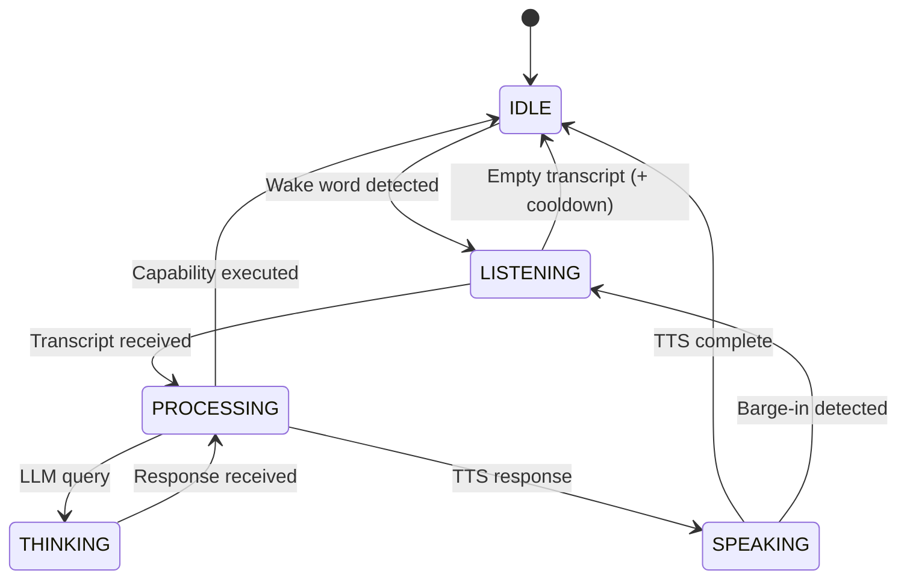

# Chintu AI Assistant - Technical Documentation

> **Version:** 4.6 | **Date:** January 14, 2026 | **Status:** Production Ready (Self-Healing)

---

## Overview

Chintu is a personal AI voice assistant for Windows that combines custom wake word detection, intelligent LLM routing, persistent memory, document understanding, live web search, and a modern Flutter UI. The system processes voice commands through a capability-based architecture with policy enforcement, budget management, context awareness, and graceful degradation that ensures all actions are safe, auditable, and predictable.

---

## Technology Stack

| Layer | Technology | Purpose |
|-------|------------|---------|
| **Wake Word** | OpenWakeWord + Custom ONNX | Detects "Hey Chintu" activation phrase |
| **Speech-to-Text** | faster-whisper (base.en) | Transcribes voice to text with confidence gating |
| **Text-to-Speech** | Edge-TTS (Azure Neural) | High-quality voice synthesis with barge-in |
| **LLM Cloud** | Groq (llama-3.1-8b) | Fast cloud inference (25/min free tier) |
| **LLM Cloud** | Google Gemini 2.0 Flash | Research/coding tasks (12/min free tier) |
| **LLM Reasoning** | Chain-of-Thought Engine | Multi-step deep reasoning for complex queries |
| **LLM Cloud** | Google Gemini 2.0 Flash | Research/coding tasks (12/min free tier) |
| **LLM Reasoning** | Chain-of-Thought Engine | Multi-step deep reasoning for complex queries |
| **LLM Local** | Ollama (qwen2.5:1.5b) | Offline fallback (unlimited) |
| **Vision** | OmniParser + Moondream | Local on-device screen analysis |
| **Web Search** | DuckDuckGo (ddgs) | Real-time web search |
| **Browser** | Playwright (Chromium) | Browser automation with safety logging |
| **Memory** | ChromaDB | Semantic search of conversations |
| **Storage** | SQLite | Tasks, tiered memory, facts |
| **Preferences** | JSON | User settings persistence |
| **Files** | PyPDF2 + python-docx | Local file reading |
| **Clipboard** | pyperclip | System clipboard access |
| **Frontend** | Flutter | Cross-platform desktop UI |
| **Communication** | WebSocket | Real-time state sync |
| **Audio** | sounddevice + pygame | Microphone capture + playback |
| **Policy** | ActionPolicyEngine | Safety guardrails & risk levels |
| **Vision** | OmniParser + OCR | Screen understanding and UI element detection |
| **Self-Healing** | Custom Logic | Auto-detection of missing credentials with chat-based fix |
| **Telemetry** | MetricsCollector | Latency tracking & observability |

---

## Proactivity Layer (Phase 5)

Chintu now includes a "Signals & Proactivity Engine" that runs locally to offer context-aware suggestions:

-   **Philosophy:** "Suggest, Don't Act" (to avoid being intrusive).
-   **Signals:** Monitors Battery, Time, CPU, and Calendar in real-time (1Hz).
-   **Rule Engine:** Evaluates strict logical rules (not LLM-based) for predictability.
-   **UI:** Broadcasts non-blocking suggestions to the Flutter interface.

**Example Rules:**
-   *Battery Warning:* "Battery is low (15%). Close background apps?"
-   *Morning Routine:* "It's 9:00 AM on a weekday. Start work apps?"

---

## Brain Architecture (Phase 6-7)

Chintu now operates with a **3-System Brain** for intelligent, personalized responses:

### 1. Verified Research (`chintu/research/verified_research.py`)
Multi-source validation with credibility scoring:
- **Tier A:** .gov, .edu, .org, Wikipedia, arxiv (⭐⭐⭐)
- **Tier B:** BBC, Reuters, NYT, TechCrunch (⭐⭐)
- **Tier C:** General web (⭐)

### 2. Learning Signals (`chintu/memory/learning_signals.py`)
Automatically detects user corrections and proposes preferences:
- "Don't use Notepad" → Proposes: "Avoid Notepad"
- "Be concise" → Updates response style

### 3. Executive Brain Loop
The command handler follows a strict reasoning loop:
```
Interpret → Recall (RAG) → Plan → Act
```

### 4. RAG Retrieval Router (`chintu/memory/retrieval_router.py`)
Smart query routing based on intent:
| Query Type | Collections | Example |
|------------|-------------|---------|
| PERSONAL | personal_facts + conversation_memory | "What's my name?" |
| RESEARCH | documents | "What did that paper say?" |
| TASK | notes/tasks | "What's on my todo?" |
| KNOWLEDGE | (Skip RAG) | "What is Python?" |

---

## System Architecture

```
┌─────────────────────────────────────────────────────────────────────────────┐
│                              FLUTTER UI                                      │
│                        (WebSocket Client :8765)                              │
└────────────────────────────────────┬────────────────────────────────────────┘
                                     │ JSON messages
┌────────────────────────────────────▼────────────────────────────────────────┐
│                           WEBSOCKET SERVER                                   │
│                   (StateManager + Debug Broadcasts)                          │
└────────────────────────────────────┬────────────────────────────────────────┘
                                     │
┌────────────────────────────────────▼────────────────────────────────────────┐
│                           MAIN CONTROLLER                                    │
│                         (ChintuAssistant)                                    │
│  ┌──────────────────────────────────────────────────────────────────────┐   │
│  │                      AUDIO PIPELINE                                   │   │
│  │  ┌─────────────┐    ┌─────────────┐    ┌─────────────┐              │   │
│  │  │AudioCapture │───>│ WakeWord    │───>│ SpeechToText│              │   │
│  │  │(sounddevice)│    │(ONNX+STT)   │    │(whisper)    │              │   │
│  │  └─────────────┘    └──────┬──────┘    └─────────────┘              │   │
│  │                     Confidence Gating + Noise Mode                   │   │
│  └──────────────────────────────────────────────────────────────────────┘   │
│                                     │ transcribed text                       │
│  ┌──────────────────────────────────▼───────────────────────────────────┐   │
│  │                     COMMAND HANDLER                                   │   │
│  │  ┌─────────────────────────────────────────────────────────────┐    │   │
│  │  │           POLICY ENGINE (Risk Levels + System State)         │    │   │
│  │  └─────────────────────────────────────────────────────────────┘    │   │
│  │  ┌─────────────────────────────────────────────────────────────┐    │   │
│  │  │              CAPABILITY REGISTRY (45 capabilities)           │    │   │
│  │  │  ┌─────────┐ ┌─────────┐ ┌─────────┐ ┌─────────┐           │    │   │
│  │  │  │open_app │ │web_search│ │reminder │ │workflow │ ...       │    │   │
│  │  │  └─────────┘ └─────────┘ └─────────┘ └─────────┘           │    │   │
│  │  └─────────────────────────────────────────────────────────────┘    │   │
│  │                          │ no match → route to LLM                   │   │
│  │  ┌───────────────────────▼───────────────────────────────────────┐  │   │
│  │  │                    MODEL ROUTER                                │  │   │
│  │  │   Budget Manager → Intent Detection → Groq/Gemini/Local       │  │   │
│  │  │   Response Caching + Metrics Recording                        │  │   │
│  │  └───────────────────────────────────────────────────────────────┘  │   │
│  └──────────────────────────────────────────────────────────────────────┘   │
│                                     │                                        │
│  ┌──────────────────────────────────▼───────────────────────────────────┐   │
│  │                     DATA LAYER                                        │   │
│  │  ┌────────────┐ ┌────────────┐ ┌────────────┐ ┌────────────┐        │   │
│  │  │ChromaDB    │ │SQLite      │ │Preferences │ │TaskManager │        │   │
│  │  │(semantic)  │ │(tiered mem)│ │(JSON)      │ │(reminders) │        │   │
│  │  └────────────┘ └────────────┘ └────────────┘ └────────────┘        │   │
│  └──────────────────────────────────────────────────────────────────────┘   │
│                                     │                                        │
│  ┌──────────────────────────────────▼───────────────────────────────────┐   │
│  │                     TEXT-TO-SPEECH                                    │   │
│  │         (Edge-TTS with SPEAKING state + barge-in support)            │   │
│  └──────────────────────────────────────────────────────────────────────┘   │
└─────────────────────────────────────────────────────────────────────────────┘
```

---

## Core Layers

### Policy Layer (`chintu/policy/`)

Safety guardrails that evaluate every capability before execution:

| File | Purpose |
|------|---------|
| `policy_engine.py` | ActionPolicyEngine with risk levels and decisions |
| `capability_contracts.py` | Risk level definitions (NONE→CRITICAL) |
| `budget_manager.py` | Rate limiting with auto-switch to cheaper providers |
| `offline_mode.py` | Graceful degradation when offline/low-power/quiet |

**Risk Levels & Actions:**

| Risk Level | Example Capabilities | Default Action |
|------------|---------------------|----------------|
| NONE | help, status, what_time | Always allow |
| LOW | open_app, clipboard_read | Allow |
| MEDIUM | web_search, open_browser | Allow (track) |
| HIGH | forget, execute_workflow | Require confirmation |
| CRITICAL | (reserved) | Require plan review |
| **UNKNOWN** | New/renamed capabilities | **Require confirmation** |

**Security Hardening (v3.5):**
- Unknown capabilities default to REQUIRE_CONFIRMATION
- Policy system state refreshes before evaluation (internet/battery/quiet)
- Configurable network health checks (`network_check_host`, `network_check_timeout_seconds`)
- Memory lazy initialization (ChromaDB only loads when `memory_enabled=true`)
- Response cache respects context (skips caching when memory_context present)

### Telemetry Layer (`chintu/telemetry/`)

Observability infrastructure:

| File | Purpose |
|------|---------|
| `trace.py` | StructuredLogger with trace IDs and timing decorators |
| `metrics.py` | MetricsCollector for latency, model usage, errors |

**Tracked Metrics:**
- Pipeline latency: wake → stt → routing → llm → tts
- Model usage: counts per provider (groq/gemini/local)
- Error categorization: network, rate_limit, api_error, unknown
- Debug info broadcast via WebSocket for UI observability

### Automation Layer (`chintu/automation/`)

Advanced task automation:

| File | Purpose |
|------|---------|
| `scheduled_tasks.py` | Daily/weekly/interval scheduling with persistence |
| `parallel_executor.py` | Background task queue with proper cancellation |
| `cross_app.py` | Data transfer between applications |
| `automation_capabilities.py` | 6 automation capabilities |
| `app_launcher.py` | Application launcher with retry logic |

### Self-Healing & Reliability
Ensures system stability even with missing configuration:
- **Credential Recovery:** Detects missing Google Calendar keys and prompts user to paste JSON directly in chat.
- **Code Audit Tools:** `tools/audit_all.bat` verifies code quality and logical integrity on demand.
- **Feature Verification:** Automated capability checks prevent placeholder implementations.


---

## LLM Routing Logic

The ModelRouter selects the optimal LLM based on intent and budget:

```python
# Intent Detection → Provider Selection
if complexity == TRIVIAL:
    return rule_based_response  # No LLM needed

if budget.can_use("groq") and prefer_cloud:
    return groq.chat(text)  # Fast cloud (25/min)

if intent in (RESEARCH, CODING) and budget.can_use("gemini"):
    return gemini.chat(text)  # Smart cloud (12/min)

if local_llm_available:
    return ollama.generate(text)  # Always available

# Fallback chain with metrics recording
```

**Budget Management:**

| Provider | Free Tier Limits | Auto-Switch |
|----------|-----------------|-------------|
| Groq | 25/min, 800/day | → Gemini → Local |
| Gemini | 12/min, 1200/day | → Groq → Local |
| Local | Unlimited | (always available) |

**Response Caching:**
- Common queries cached (1hr TTL)
- Skips caching when memory_context is present (personalized replies)
- Cooldown handling after rate limit errors

---

## Wake Word Detection

Custom "Hey Chintu" detection with **Dynamic Confirmation**:

```python
# Detection Pipeline
audio → OpenWakeWord (ONNX) → Dynamic Gating → Wake Trigger

# Dynamic Gating Strategy (v4.9)
if is_speaking:
    # HARD MODE: Require STT Verification (Prevents strict self-interrupts)
    confirm_with_stt = True
else:
    # SPEED MODE: Direct Activation (Instant response when silent)
    confirm_with_stt = False
```

**Configuration:**
```python
wake_word_sensitivity: 0.92       # High threshold
wake_word_activation_frames: 2    # Reduced for speed (was 6)
wake_word_cooldown_seconds: 0.5   # Reduced for speed (was 5.0)
```

---

## **New** Self-Healing Engine ("Antigravity")

Chintu now possesses the ability to analyze and patch its own code:

1.  **CodingAgent:** An autonomous agent (`chintu/agents/coding_agent.py`) that uses LLMs to generate valid Python code fixes.
2.  **Code Approval UI:** A safety layer that presents a **Diff View** to the user via a glassmorphic popup.
3.  **Workflow:**
    *   User reports bug -> Chintu analyzes -> Proposes Fix (Popup) -> User Approves -> Fix Applied.
    *   *No code is ever written without explicit user confirmation.*


---

## 45 Registered Capabilities

### System Actions (6)
| Capability | Triggers | Risk |
|------------|----------|------|
| `open_app` | "open", "launch", "start" | LOW |
| `open_url` | "go to", "visit", ".com" | LOW |
| `system_info` | "what time", "date", "battery" | NONE |
| `status` | "status", "system status" | NONE |
| `close_app` | "close app", "close it" | LOW |
| `list_windows` | "what windows are open", "list apps" | LOW |

### Web Search (3)
| Capability | Triggers | Risk |
|------------|----------|------|
| `web_search` | "search for", "google", "look up" | MEDIUM |
| `news_search` | "latest news", "headlines" | MEDIUM |
| `deep_search` | "research", "investigate" | MEDIUM |

### Browser Automation (6)
| Capability | Triggers | Risk |
|------------|----------|------|
| `open_browser` | "open browser" | MEDIUM |
| `browser_navigate` | "go to [url]" | MEDIUM |
| `browser_click` | "click [element]" | HIGH |
| `browser_type` | "type [text]" | HIGH |
| `browser_screenshot` | "take screenshot" | LOW |
| `close_browser` | "close browser" | LOW |

### Memory (7)
| Capability | Triggers | Risk |
|------------|----------|------|
| `remember` | "remember that" | LOW |
| `recall` | "what do you remember" | NONE |
| `recall_facts` | "recall facts" | NONE |
| `forget` | "forget everything" | HIGH |
| `take_note` | "take a note" | LOW |
| `list_notes` | "show my notes" | NONE |
| `context_recall` | "what did we talk about" | NONE |
| `get_last_opened_app` | "what did you open" | NONE |

### Tasks & Reminders (5)
| Capability | Triggers | Risk |
|------------|----------|------|
| `set_reminder` | "remind me" | LOW |
| `list_reminders` | "show my reminders" | NONE |
| `cancel_reminder` | "cancel reminder" | MEDIUM |
| `clear_reminders` | "cancel all reminders" | HIGH |
| `schedule_task` | "schedule" | MEDIUM |

### Automation (6)
| Capability | Triggers | Risk |
|------------|----------|------|
| `create_workflow` | "create a workflow" | MEDIUM |
| `execute_workflow` | "execute workflow" | HIGH |
| `schedule_workflow` | "schedule this daily/weekly" | MEDIUM |
| `list_schedules` | "show scheduled tasks" | NONE |
| `parallel_tasks` | "run in parallel" | HIGH |
| `transfer_data` | "transfer data from X to Y" | HIGH |

### Files (5)
| Capability | Triggers | Risk |
|------------|----------|------|
| `read_file` | "read [file]" | LOW |
| `list_files` | "list my documents" | NONE |
| `summarize_file` | "summarize the file" | MEDIUM |
| `clipboard_read` | "what's in clipboard" | LOW |
| `clipboard_write` | "copy to clipboard" | LOW |

### AI Agents (3)
| Capability | Triggers | Risk |
|------------|----------|------|
| `plan_task` | "plan a trip", "plan" | MEDIUM |
| `execute_plan` | "execute the plan" | HIGH |
| `agent_research` | "research [topic]" | MEDIUM |
| `reasoning` | "think deeply", "analyze", "why is" | MEDIUM |

### General (6)
| Capability | Triggers | Risk |
|------------|----------|------|
| `help` | "help", "what can you do" | NONE |
| `stop` | "stop", "cancel" | NONE |
| `read_response` | "read it" | NONE |
| `conversation` | (fallback to LLM) | NONE |
| `confirm_yes` | "yes", "confirm" | NONE |
| `confirm_no` | "no", "cancel" | NONE |

| `confirm_no` | "no", "cancel" | NONE |

### Visual Automation (2) - NEW
| Capability | Triggers | Risk |
|------------|----------|------|
| `screen_click` | "click [element]" | MEDIUM |
| `screen_find` | "find [element]" | LOW |

---

## Visual Automation (On-Device)

Chintu employs a "Privacy-First" visual system:
1.  **Capture:** Takes a screenshot using `mss`.
2.  **Analysis:** Uses `Moondream` (via Ollama) locally to find coordinates of UI elements.
    -   *Fallback:* Tries Gemini 2.0 Flash if configured, then Local.
3.  **Action:** Uses `pyautogui` to move the mouse and click.

**Benefits:**
-   **No API Costs:** Runs entirely on CPU/GPU.
-   **Privacy:** Screenshots never leave the device (in local mode).
-   **Unlimited:** No rate limits.

## State Machine



**State Broadcasts (WebSocket):**
```json
{
  "type": "state_update",
  "data": {
    "assistant_state": "speaking",
    "current_transcript": "",
    "last_response": "Opening Chrome.",
    "features": {"wake_word": {"status": "active"}},
    "debug": {"last_model": "groq", "last_capability": "open_app"}
  }
}
```

---

## File Structure

```
Chimptu/
├── main.py                        # Entry point (ChintuAssistant)
├── start_chintu.bat               # Windows batch launcher
├── requirements.txt               # Python dependencies
├── .env                           # API keys (GROQ_API_KEY, GOOGLE_AI_KEY)
│
├── chintu/                        # Main Python package (16 modules)
│   ├── __init__.py
│   │
│   ├── core/                      # Core infrastructure (19 files)
│   │   ├── config.py              # Pydantic settings with ConfigDict
│   │   ├── state.py               # StateManager with SPEAKING state
│   │   ├── events.py              # Thread-safe EventBus
│   │   ├── capabilities.py        # CapabilityRegistry with policy checks
│   │   ├── capability_handlers.py # Core capability handlers
│   │   ├── command_handler.py     # CommandHandler with lazy memory init
│   │   ├── model_router.py        # ModelRouter with budget/metrics
│   │   ├── websocket_server.py    # Modern websockets API
│   │   ├── help_capabilities.py   # Help and status capabilities
│   │   ├── executive.py           # ExecutiveBrain for multi-step tasks
│   │   ├── capabilities_registry.py # UI Categorization & Metadata
│   │   ├── policy.py              # Policy re-exports (compatibility)
│   │   ├── budget_manager.py      # Budget re-exports (compatibility)
│   │   ├── degraded_mode.py       # Degraded re-exports (compatibility)
│   │   ├── metrics.py             # Metrics re-exports (compatibility)
│   │   └── logging_config.py      # Logging re-exports (compatibility)
│   │
│   ├── policy/                    # Safety & budgets (5 files)
│   │   ├── __init__.py
│   │   ├── policy_engine.py       # ActionPolicyEngine
│   │   ├── capability_contracts.py # RiskLevel enum
│   │   ├── budget_manager.py      # RateLimitBudgetManager
│   │   └── offline_mode.py        # OfflineDegradedMode
│   │
│   ├── telemetry/                 # Observability (3 files)
│   │   ├── __init__.py
│   │   ├── trace.py               # StructuredLogger, trace IDs
│   │   └── metrics.py             # MetricsCollector
│   │
│   ├── audio/                     # Voice I/O (6 files)
│   │   ├── audio_capture.py       # Microphone input
│   │   ├── wake_word.py           # WakeWordDetector with noise mode
│   │   ├── speech_to_text.py      # faster-whisper STT
│   │   ├── text_to_speech.py      # Edge-TTS with SPEAKING state
│   │   └── audio_utils.py
│   │
│   ├── search/                    # Web search (4 files)
│   │   ├── search_engine.py       # DuckDuckGo client
│   │   ├── deep_search.py         # Multi-source research
│   │   └── search_capabilities.py
│   │
│   ├── browser/                   # Browser automation (3 files)
│   │   ├── browser_controller.py  # Playwright with failure logging
│   │   └── browser_capabilities.py
│   │
│   ├── agents/                    # Agentic workflows (4 files)
│   │   ├── task_planner.py        # LLM-based planning
│   │   ├── workflow_engine.py     # Step execution
│   │   └── agent_capabilities.py
│   │
│   ├── automation/                # Scheduled automation (8 files)
│   │   ├── scheduled_tasks.py     # Cron-like scheduling
│   │   ├── parallel_executor.py   # Background queue with cancellation
│   │   ├── cross_app.py           # Data transfer
│   │   ├── app_launcher.py        # App launcher
│   │   ├── window_services.py     # Window Listing Service
│   │   └── automation_capabilities.py
│   │
│   ├── files/                     # File operations (3 files)
│   │   ├── file_handler.py        # PDF, DOCX, TXT reader
│   │   └── file_capabilities.py
│   │
│   ├── memory/                    # Persistent memory (8 files)
│   │   ├── memory_manager.py      # ChromaDB + MemoryManager
│   │   ├── preferences.py         # PreferenceManager (JSON)
│   │   ├── tiered_memory.py       # TieredMemoryStore (SQLite)
│   │   └── memory_capabilities.py
│   │
│   ├── tasks/                     # Reminders (3 files)
│   │   ├── task_manager.py        # TaskManager with background thread
│   │   └── task_capabilities.py
│   │
│   ├── training/                  # Fine-tuning data (3 files)
│   │   ├── gold_data.py           # GoldDataManager
│   │   ├── training_logger.py     # JSONL logging
│   │   └── chintu_finetune.ipynb  # Colab notebook for LoRA
│   │
│   ├── llm/                       # Local LLM (2 files)
│   │   └── ollama_client.py
│   │
│   ├── vision/                    # Gesture recognition (3 files)
│   │   ├── hand_tracker.py
│   │   └── gesture_recognizer.py
│   │
│   └── utils/                     # Utilities (3 files)
│
├── chintu_ui/                     # Flutter frontend
│   ├── lib/
│   │   ├── main.dart
│   │   ├── screens/
│   │   └── widgets/
│   └── pubspec.yaml
│
├── tests/                         # Unit tests
│   ├── test_capabilities.py       # 18 tests
│   ├── test_reliability.py        # 22 tests
│   └── test_automation_fixes.py   # 4 tests
│
├── tools/                         # Maintenance & Audit (9 files)
│   ├── audit_all.bat              # One-click system health check
│   ├── audit_code.py              # Code quality scanner
│   ├── check_deps.py              # Dependency verifier
│   └── ...
└── ~/.chintu/                     # User data directory
    ├── wakeword/hey_chintu.onnx   # Custom wake word model
    ├── memory_db/                 # ChromaDB embeddings
    ├── tiered_memory.db           # SQLite tiered storage
    ├── preferences.json           # User preferences
    ├── tasks.db                   # Reminders database
    └── training/
        ├── interactions.jsonl     # Training data log
        └── exports/               # JSONL exports for fine-tuning
```

---

## Configuration Reference

```python
# chintu/core/config.py (with ConfigDict for Pydantic v2)

# Wake Word
wake_word: str = "hey chintu"
wake_word_sensitivity: float = 0.92
wake_word_cooldown_seconds: float = 5.0
wake_word_activation_frames: int = 6
wake_word_confirm_with_stt: bool = True
wake_word_stt_confidence_threshold: float = 0.6
wake_word_noise_mode: bool = False
wake_word_min_word_count: int = 2

# Speech-to-Text
whisper_model: str = "base.en"
stt_timeout_seconds: float = 20.0
stt_silence_duration: float = 1.2
stt_min_confidence: float = 0.45

# Conversation
conversation_mode: bool = True
conversation_timeout_seconds: float = 15.0

# TTS
tts_auto_speak: bool = False
tts_streaming: bool = False
tts_prompt_after_response: bool = True

# Memory
memory_enabled: bool = True
memory_top_k: int = 4

# Network Health Checks
network_check_host: str = "8.8.8.8"
network_check_port: int = 53
network_check_timeout_seconds: float = 3.0

# LLM
ollama_host: str = "http://localhost:11434"
ollama_model: str = "qwen2.5:1.5b"

# Training
training_log_enabled: bool = True
training_auto_approve: bool = True

# API Keys (from .env)
google_ai_key: Optional[str] = None
groq_api_key: Optional[str] = None
```

---

## Running & Testing

```bash
# Activate virtual environment
venv\Scripts\activate

# Run backend only
python run_chintu.py

# Run with Flutter UI
python run_chintu.py --with-ui
# or
start_chintu.bat

# Run tests
python -m pytest tests -q
# Output: 44 passed, 2 warnings

# Flutter analysis
cd chintu_ui && flutter analyze
# Output: No issues found!
```

---

## Example Session

```
[System starts]
==================================================
Chintu Personal AI Assistant
==================================================
WebSocket: ws://127.0.0.1:8765
Say 'hey chintu' to activate
==================================================

Listening... (Ctrl+C to stop)

[User]: "Hey Chintu"
Wake word detected (confidence: 0.78) | State: IDLE → LISTENING

[User]: "What can you do?"
Matched capability: help (risk: NONE)
[Response]: I can help with system actions, web search, reminders,
browser automation, file operations, and more. Say "help" for details.

[User]: "Search for Python tutorials"
Policy: ALLOW (risk: MEDIUM)
Budget: groq (15/25 used this minute)
Using provider: groq
[Response]: Here are the top Python tutorials: ...

[User]: "Forget everything"
Policy: REQUIRE_CONFIRMATION (risk: HIGH)
[Response]: This will delete all your memories. Are you sure?

[User]: "Yes"
[Response]: All memories cleared.
```

---

## Version History

| Version | Date | Changes |
|---------|------|---------|
| 4.9 | 2026-01-18 | **Self-Coding Engine** (Antigravity), **Dynamic Wake Word** (Silent/Speaking Modes), **Self-Awareness** (Status Checks) |
| 4.8 | 2026-01-16 | **Proactive Intelligence** (Signals & Rule Engine), **Reliability** (Repairs, Gating) |
| 4.7 | 2026-01-16 | **On-Device Vision** (Moondream), **UI/Audio Sync**, Hardcoded Greeting Removal, Privacy Enhancements |
| 4.5 | 2026-01-13 | Screenshot, Clipboard, Repeat Command, Context Awareness, Conversation Memory |
| 4.0 | 2026-01-13 | Document Understanding, Live Web Search, URL Reading, Deep Reasoning, Calendar, Smart Home |
| 3.7 | 2026-01-12 | ChatGPT fixes: Interrupt handler, STT confidence, process-based wake word, LLM timeout |
| 3.6 | 2026-01-12 | Window Management Service, UI Capability Categorization, Startup Optimization |
| 3.5 | 2026-01-07 | Security hardening, policy/telemetry modules, 44 tests |
| 3.4 | 2026-01-04 | Reliability layer, budget manager, metrics |
| 3.3 | 2026-01-01 | Automation phase, scheduled workflows |
| 3.2 | 2025-12-30 | Browser automation, Flutter UI |
| 3.1 | 2025-12-28 | Model router, TTS control |
| 3.0 | 2025-12-25 | Initial release with wake word |

