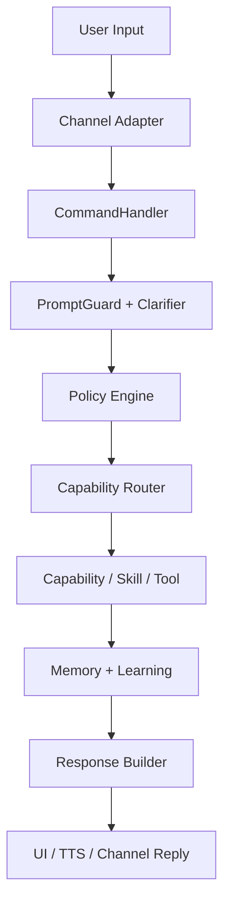
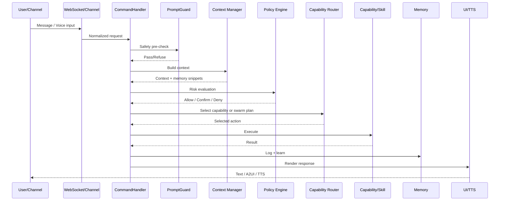
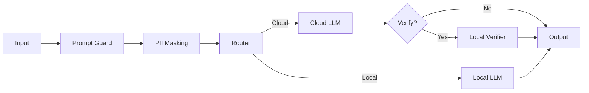
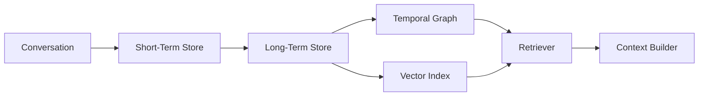
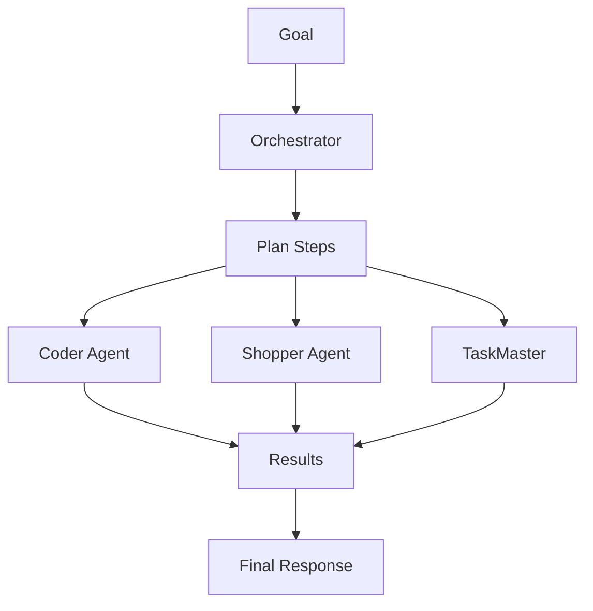
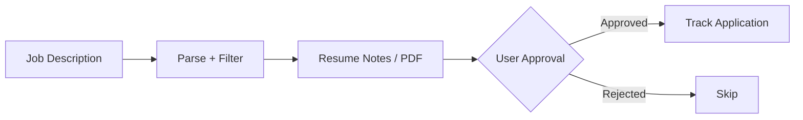

# Chintu AI - System Guide (Windows)

This document is the high-level **Windows-focused system guide** for Chintu.  
For the full technical reference (architecture, internals, reliability, tooling), see:

- `docs/TECHNICAL_OVERVIEW.md`

---

## Quick Navigation
- `docs/PRD/PRODUCT_REQUIREMENTS.md` - product requirements and success criteria
- `docs/DEVELOPER_ONBOARDING.md` - setup and contribution workflow for new engineers
- `docs/ARCHITECTURE.md` - architecture diagrams and runtime control flow
- `docs/TECHNICAL_OVERVIEW.md` - full technical architecture and internals
- `docs/STRUCTURE.md` - project structure and where to edit
- `docs/guides/INSTALLATION.md` - setup steps
- `docs/guides/USAGE.md` - usage guide
- `docs/guides/DEAL_FINDER.md` - price compare (Amazon/Newegg etc.)
- `docs/guides/CODE_INTERPRETER.md` - sandboxed code execution and safety notes
- `docs/BROWSER_FALLBACK.md` - browser fallback and CDP notes
- `docs/MCP_SANDBOX.md` - MCP sandboxing and tool execution notes
- `docs/PERFORMANCE.md` - performance profile and tuning notes
- `docs/vision.md` - screen/vision architecture, model routing, and probe workflow
- `docs/TESTING.md` - unit tests, targeted suites, and scenario benchmark commands
- `docs/MAINTENANCE.md` - cleanup/retention workflow and refactor guardrails
- `docs/CODEBASE_AUDIT.md` - current hygiene findings, cleanup status, and modularization backlog
- `docs/ARCHITECTURE_GATEWAY.md` - gateway/control-plane design reference
- `docs/TOOL_SCHEMA.md` - tool schema and policy integration reference
- `docs/release_checklist.md` - must-not-break release gates
- `docs/STYLE_GUIDE.md` - documentation conventions for this repo
- `docs/examples/claude_desktop_config.json` - example MCP server registration for desktop clients
- `docs/runbooks/README.md` - operational runbook contract
- `docs/runbooks/DEPLOYMENT_PREFLIGHT.md` - deployment readiness and preflight gates
- `docs/runbooks/INCIDENT_RESPONSE.md` - incident response steps
- `docs/runbooks/DISASTER_RECOVERY.md` - recovery checklist
- `docs/runbooks/WEEKLY_MAINTENANCE.md` - weekly health + hygiene checklist
- `docs/runbooks/RELEASE_PACKAGING.md` - release packaging and distribution runbook
- `docs/runbooks/benchmark_live.md` - strict live benchmark execution and evidence
- `docs/runbooks/content_studio_short.md` - local 30s short generation runbook
- `docs/PLANS/chintu_ultimate_plan.md` - phase-by-phase roadmap and phase contracts
- `docs/PLANS/PHASE_LOCKS.md` - single lock-state index for implemented phases
- `docs/PLANS/Chintu AI - Comprehensive Audit Rep.md` - audit report snapshot
- `docs/MANUAL_QA_MATRIX.md` - test inputs and expected results

---

## 1) Core Idea (What Chintu Is)
Chintu is a Windows-first personal AI assistant that combines:
- Local wake-word and voice input
- UI + channel messaging (Telegram, WhatsApp)
- A capability registry with safety policies
- Hybrid memory and learning journal
- Local-first models with cloud routing + verification
- UI automation and controlled system actions
- Swarm orchestration for complex goals

Goals:
- Reliable (no silent failures)
- Secure (policy gating, confirmations, masking)
- Extensible (skills, MCP tools, automation)

---

## 2) Chain of Command (Who Decides What)
The chain of command is the order of systems that interpret and act on a request.



Key decisions:
- PromptGuard blocks unsafe injection.
- Policy Engine enforces risk gating.
- Router picks a capability or a swarm plan.
- Execution tools run with explicit constraints.

---

## 3) End-to-End Runtime Workflow



---

## 4) Model Routing and Verification



Routing rules:
- Prefer local models for sensitive work.
- Use cloud models for higher complexity or missing capabilities.
- Cloud outputs can be verified by a local verifier model.
- PII masking can be enabled for any cloud-bound content.

---

## 5) Capability System (Core Actions)
Capabilities are safe, auditable actions defined in Python and registered by the loader.

### Registration Flow
```
register_all_capabilities()
  -> core + help
  -> memory + temporal
  -> search + files + browser
  -> automation + tasks + goals
  -> vision + screen tools
  -> job apply + media
  -> mcp + tools + security
  -> watchdog + orchestrator + eval
  -> skills (SKILL.md + proposals)
```

### Capability Categories
- Core: help, status, reasoning, context, clipboard
- Memory: remember, recall, forget, preferences
- Tasks and goals: create, list, update, reminders
- Automation: app open/close, window control
- Browser: open/search/read URLs
- Files: list/read/document parsing
- Vision: OCR, screen element find/click
- Job apply: parse JD, filter, resume notes, track
- Media: image analyze, video summary, news video pipeline
- Figma automation: open and snapshot
- Security: identity vault, login workflows
- Workflows: deterministic YAML/JSON recipes
- Learning: journal, weekly export, status
- MCP: tool registry, server calls
- Orchestrator: approvals, multi-step projects
- Watchdog: process recovery

---

## 6) Skills System (SKILL.md)
Skills are Markdown-defined integrations with precedence and approvals.

### Sources and Precedence
1) `chintu_backend/automation/skills/bundled/`
2) `~/.chintu/skills_learned/`
3) `~/.chintu/skills/`
4) `./skills/` (workspace override)

### Security Controls
- Skills require approval before activation
- Shell skills require allowlist/denylist
- Optional Docker sandbox isolation
- Regression tests run on approval when provided
- Rollback via proposal history
- YAML frontmatter supported for instruction-only skills

---

## 7) Memory System
Hybrid memory architecture:



Key features:
- Preference and fact recall
- Summaries for long conversations
- Lifecycle management (dedupe, decay)
- Markdown sync for glass-box memory (`~/.chintu/brain_md`)
- RAG retrieval via hybrid search (FTS + vector hashing)

Learning journal:
- Events in `~/.chintu/learning/events.jsonl`
- Human log: `~/.chintu/brain_md/Learning.md`
- Weekly export: `~/.chintu/training/exports/weekly_learning_YYYYMMDD.jsonl`

---

## 8) Swarm Orchestration (The Hive)
For complex goals, Chintu uses a Hierarchical Task Network (HTN).



Mechanics:
- Orchestrator builds a plan
- Specialized agents execute steps
- Arbitrator manages budgets and confirmations
- Structured trace logs support audits
- Per-agent workspaces and session logs under `data/agents/`

---

## 9) Safety, Reliability, and Governance
- Policy engine for high-risk actions
- Confirmations for irreversible steps
- Optional local verification of cloud responses
- PII masking for cloud-bound content
- Watchdog for stuck processes
- Eval harness for routing and refusal consistency
- Change journal for code edits (optional git commits)

---

## 10) System Control and Multimodal
- System control arbitration serializes OS actions for safety
- Gesture actions are parked under `chintu_backend/future/`
- Screen tools require explicit user intent

---

## 11) UI and Operator Tooling
- Flutter UI with panels for sessions, cron, usage, and applications
- A2UI cards for approvals and forms
- CLI: `chintu doctor`, `chintu config`, `chintu skills`, `chintu gateway`

---

## 12) Technologies and Tools Used

### Languages
- Python (backend + orchestration)
- Dart/Flutter (UI)
- PowerShell/Batch scripts (launcher, setup)

### Storage
- SQLite (memory and job tracking)
- JSONL logs (learning journal, change log)
- Markdown (brain sync, skills)

### LLM and AI
- Local models via Ollama (routing/planning/coding/research)
- Cloud models: Gemini, Groq, DeepSeek, NVIDIA NIM
- Optional local verifier for cloud outputs

### Automation + Vision
- System control: Windows app/window automation
- OCR and screen element detection
- Browser open/search/read
- Media pipeline: ffmpeg for frame extraction and TTS

### Infrastructure
- WebSocket server (UI messaging)
- Scheduler for cron jobs
- Policy engine for confirmations
- MCP tool registry

---

## 13) Key Paths
- `chintu_backend/core/command_handler.py` - main brain
- `chintu_backend/core/session_manager.py` - session tracking
- `chintu_backend/core/scheduler.py` - cron and scheduling
- `chintu_backend/core/model_router.py` - routing logic
- `chintu_backend/core/config_writer.py` - chat-based config updates
- `chintu_backend/automation/job_apply.py` - job apply pipeline
- `chintu_backend/automation/media_pipeline.py` - image/video/news
- `chintu_backend/automation/figma_automation.py` - figma actions
- `chintu_backend/brain/memory/` - memory stack
- `chintu_backend/brain/learning/` - learning engine
- `chintu_backend/automation/skills/skill_registry.py` - skills
- `chintu_backend/eval/` - eval harness

---

## 14) Workflow Examples (Visual)

### Job Apply Flow


### Cron/Scheduler Flow


---

*Chintu AI - System Guide (Windows)*

