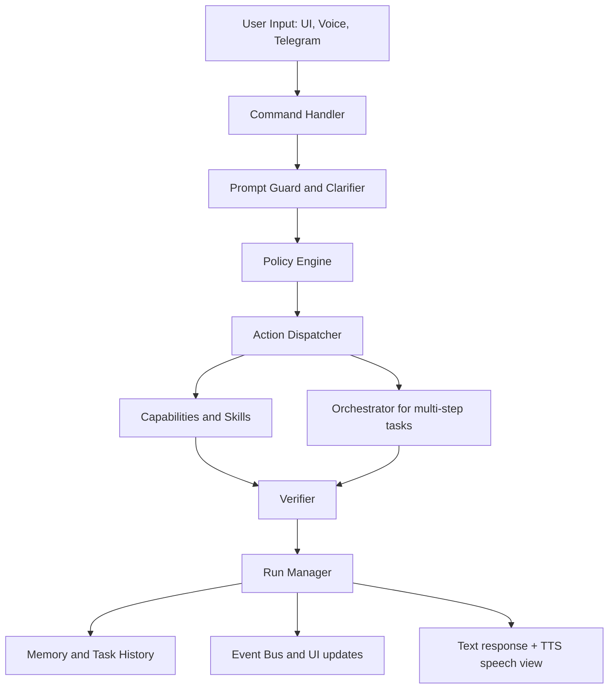
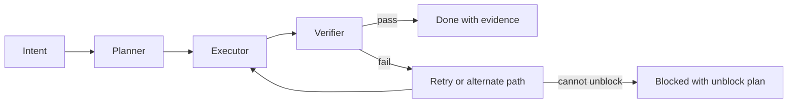
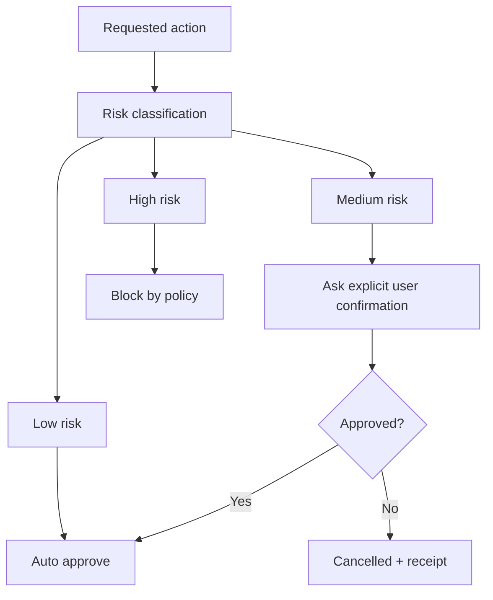

# Chintu AI Master Product Requirements Document (PRD + Technical Specification)

**Document owner:** Chintu Engineering  
**Version:** 2.1  
**Last updated (UTC):** 2026-03-03 06:01:29Z  
**Status:** Active implementation baseline and handoff spec

---

## 1. Purpose of this Document

This is the single comprehensive document for understanding Chintu end-to-end.
If a new engineer or an external model (ChatGPT, Gemini, Claude) reads only this file, they should be able to understand:
- what Chintu is and why it exists,
- what Chintu can do (capabilities + skills),
- how Chintu is implemented (architecture, modules, data flow),
- what constraints and safety boundaries are enforced,
- how to extend, test, and operate the system without breaking guarantees.

This document combines product requirements with implementation-level technical details by design.

---

## 2. Product Definition

### 2.1 Vision
Chintu is a local-first autonomous assistant for Windows that executes real tasks with evidence, policy control, and human-in-the-loop safety for sensitive actions.

### 2.2 Mission
Deliver a reliable cofounder-grade assistant that can plan, execute, verify, and continuously improve while maintaining strict safety boundaries.

### 2.3 Operating Principles
- No evidence, no success.
- Generalized skills over one-off hardcoded task handlers.
- Local-first routing, cloud as controlled augmentation.
- Explicit approvals for risky actions.
- Auditable operations with run receipts and dossiers.

### 2.4 Executive Architectural Synthesis
- Local-first sovereignty is mandatory; completion is valid only when evidence exists.
- The Planner-Executor-Verifier loop is the primary control law for autonomous execution.
- Cloud escalation cascade and browser-as-model fallback are deterministic augmentations, not primary paths.
- Every escalation must emit structured artifacts suitable for gated learning and post-run auditing.
- Dual-GPU operation is asymmetric by design; tensor-splitting one model across mismatched GPUs is prohibited.
- Skills are modular, typed, sandboxable, and policy-gated; autonomous skill synthesis is allowed only through this controlled pipeline.
- Remote control is provided via Telegram approvals and dashboards; local observability is provided via Flutter desktop UI.

---

## 3. Scope

### 3.1 In scope
- Text and voice command handling.
- Windows OS control, browser automation, productivity actions.
- Memory, retrieval, knowledge ingestion, and training export pipelines.
- Multi-model orchestration (local + cloud providers).
- Skills framework with trust and supply-chain controls.
- Integrations (calendar, channels, communications) behind policy gates.

### 3.2 Out of scope or hard blocked
- Autonomous payment, checkout, or subscription actions.
- Silent destructive file/system operations without explicit approval.
- Unreviewed third-party code execution on host without sandbox policy.

### 3.3 Explicit negative constraints (non-goals)
- Single-tenant only for this cycle (no multi-tenant RBAC/memory partitioning).
- No native iOS/Android apps; remote control is Telegram-only.
- No custom UI for fine-tuning/hyperparameter tuning; training remains scripted/background.
- No foundation model pre-training from scratch.
- No autonomous payments/checkout under any mode.

---

## 4. Target Runtime Environment

- Primary OS: Windows
- Primary runtime: Python backend + optional Flutter UI
- Supported model strategy: local Ollama, cloud APIs, cloud Ollama endpoints, CPU fallback
- Expected hardware profile: multi-GPU aware (e.g., RTX 3060 + GTX 1650)

### 4.1 Hardware asymmetry and model placement (RTX 3060 + GTX 1650)

| GPU | VRAM | Operational role | Workload profile |
| --- | --- | --- | --- |
| RTX 3060 (Ampere) | 12 GB | Primary reasoning brain | planning, code generation, multi-step decision loops |
| GTX 1650 (Turing) | 4 GB | Perception/utility tier | embeddings, STT, lightweight classification, selected vision support |

Hard rule:
- Do not tensor-split a single LLM across these mismatched GPUs; use separate inference processes per GPU role to avoid PCIe synchronization bottlenecks.

Current vs planned:
- Current: model router and VRAM pressure controls are active; tiered GPU hints exist.
- Planned: explicit per-GPU telemetry and per-role inference endpoints (brain vs embeddings/STT/vision) with deterministic routing contracts.

### 4.2 Runtime topology and infrastructure scope
- Deployment scope for this cycle is single-machine and single-tenant.
- Baseline runtime topology is single-process orchestration with internal queues (`asyncio`/threaded workers) for decoupling and backpressure.
- Redis/RabbitMQ queues and microservices decomposition are deferred/optional and are not prerequisites for the current roadmap contract.
- Horizontal scaling and service discovery are explicitly out of near-term release scope.

---

## 5. System Architecture

### 5.1 End-to-end request flow

### 5.2 Planner-Executor-Verifier loop

### 5.3 Safety gate flow

---

## 6. Implementation Map (Code Ownership)

| Layer | Primary implementation paths | Notes |
| --- | --- | --- |
| Core runtime | `chintu_backend/core/command_handler.py`, `action_dispatcher.py`, `capabilities.py`, `capability_loader.py` | Command orchestration, routing, capability match and execution |
| Run and events | `chintu_backend/core/run_manager.py`, `events.py` | Run lifecycle, receipts, event bus streaming |
| Policy and security | `chintu_backend/security/`, policy modules under `core` | Approval rules, identity vault, login controls |
| Model routing | `chintu_backend/core/model_router.py` | Local/cloud provider selection and fallback |
| Memory and history | `chintu_backend/brain/memory/`, `core/task_history.py` | Recall, retrieval, dossier storage, training export |
| Browser automation | `chintu_backend/automation/browser/` | DOM-first automation and evidence extraction |
| Skills framework | `chintu_backend/automation/skills/`, `skills/` | Skill registry, policy checks, proposal lifecycle |
| Integrations/channels | `chintu_backend/channels/`, communication/integration modules | Telegram intake, communications adapters |
| Orchestrator | `chintu_backend/orchestrator/` | Multi-step project execution and checkpoints |
| Voice and audio | `chintu_backend/audio/` | STT/TTS pipeline and speech sanitization |
| UI | `chintu_ui/` | Operator interface and run visibility |

---

## 7. Functional Requirements by Domain

### 7.1 Command and conversation
- Parse free-form natural language into capability actions or plans.
- Handle follow-up context (`read more #N`, `open #N`) across turns.
- Return a complete text response and a humanized speech response.

### 7.2 OS control and productivity
- Open/close/minimize applications and windows.
- Control volume and basic desktop actions.
- Handle notes, reminders, timers, tasks, and calendar operations.

### 7.3 Browser and research
- Search and navigate web sources with relevance gating.
- Extract evidence and summarize with provenance.
- Support deep research with expansion follow-ups.

### 7.4 Skills and extension system
- Load workspace/user/bundled skills with deterministic command adapters.
- Enforce supply-chain and trust checks before third-party activation.
- Support skill proposal, approval, and future self-improvement loops.

### 7.5 Memory and learning
- Persist structured task history and run dossiers.
- Provide recall with provenance and filtering.
- Export sanitized training data for local model improvement loops.

### 7.6 Integrations and communications
- Integrate OAuth-based services (e.g., Google Calendar).
- Process Telegram inbox items (text, links, media) into knowledge artifacts.
- Support communications workflows with owner-first policy rules.

---

## 8. Non-Functional Requirements

### 8.1 Reliability
- Run timeouts and watchdog checks must prevent silent hangs.
- Verification retries for selected capabilities must reduce false success.
- Failures must return explicit unblock plans where possible.

### 8.2 Security
- Payment and checkout paths remain blocked.
- Destructive and publish actions require confirmation.
- Secrets must not be logged in chat transcripts or reports.

### 8.3 Performance
- Dual-GPU-aware routing should avoid resource contention.
- Context budget manager should limit prompt bloat.
- Heavy tasks should be schedulable during idle/off-hours windows.

### 8.4 Maintainability
- Modular boundaries documented and enforced by tests.
- Docs must remain synchronized with behavior changes.
- No duplicate source-of-truth docs for the same topic.

### 8.5 Continuous Self-Learning Pipeline (Gated)
- Data sources:
  - run event logs,
  - run receipts,
  - escalation branches,
  - verified outcomes.
- Curation rules:
  - exclude sensitive and approval-gated runs by default,
  - redact credentials and PII before dataset export,
  - never store or train on chain-of-thought.
- Training policy:
  - adapters only (LoRA/QLoRA), base models remain immutable,
  - promotion requires evaluation suite plus scenario set,
  - activating a new adapter or changing routing weights requires explicit approval.
- Artifact/version requirements:
  - adapter version ID,
  - dataset hash,
  - evaluation metrics,
  - rollback instructions,
  - signed/immutable run receipt for the training cycle.

---

## 9. Security and Governance Policies

Hard rules currently enforced in architecture and config:
- No autonomous payment/purchase actions.
- Destructive operations require explicit confirmation.
- Publishing/logins/account-modification are gated.
- Third-party skill/plugin trust checks are mandatory when supply-chain enforcement is enabled.
- Channel trust level affects execution profile and allowed action surface.

Governance tracking:
- plan contract: `docs/PLANS/chintu_ultimate_plan.md`
- lock index: `docs/PLANS/PHASE_LOCKS.md`

---

## 10. Model and Provider Orchestration

Primary model-routing design:
- local-first default for privacy and deterministic control,
- cloud provider fallback based on availability, latency, and budget,
- optional cloud-Ollama path before local CPU fallback.

Configured provider families include:
- local Ollama models
- NVIDIA NIM
- Groq
- Gemini
- DeepSeek
- optional additional adapters via config and integrations

Execution control features:
- context-budget controls,
- fast-path thresholds in dispatcher,
- per-step GPU hints and fallback policies,
- route telemetry and learning-ready logs.

### 10.1 Cloud Escalation Cascade
Escalation trigger reason codes (examples):
- `verifier_fail_budget_exhausted`
- `tool_schema_validation_loop`
- `repeated_syntax_error_generation`
- `context_overflow_risk`
- `local_model_timeout_or_oom`

Default escalation order:
1. local model
2. cloud API model (with policy and privacy masking)
3. browser-as-model fallback (approval-gated, dedicated profile by default)
4. blocked with explicit unblock plan

Escalation audit contract:
- record reason code,
- record sanitized input/context snapshot,
- record returned structured solution (tool-call oriented when available),
- record downstream evidence artifacts produced during execution/verification.

### 10.2 Browser-as-Model Fallback (CDP, authenticated, gated)
Default posture:
- use dedicated Chintu browser profiles for research and logged-in account actions,
- sending prompts or uploading files is an account action and requires explicit approval.

Evidence contract:
- persist screenshots, extracted text, prompt payload, and response payload into the run dossier.

Reliability contract:
- detect completion of streamed responses,
- retry with bounded timeout budgets,
- use DOM-first automation with vision fallback only when DOM strategy fails,
- scan returned browser content for prompt injection before tool-execution reuse.

Implementation anchors:
- `docs/BROWSER_FALLBACK.md`
- `chintu_backend/automation/browser/browser_fallback.py`

### 10.3 Persona Adapters (Planned)
- Router quickly classifies domain intent via lightweight heuristics/classification.
- Persona routing selects both adapter and playbook, not a separate memory graph.
- Memory remains shared across personas; personas are behavior overlays.
- Adapter activation stays gated by evaluation and explicit approval.

---

## 11. Data, Storage, and Artifacts

Core data surfaces:
- runtime state under `~/.chintu/`
- run events and receipts under `~/.chintu/runs/<run_id>/`
- logs under `logs/`
- canonical test reports under `tests/reports/`
- ephemeral diagnostics under `generated_reports/`

Data classes persisted through runtime include:
- task intent and session metadata
- plan steps and per-step outcomes
- tool/capability outputs and evidence references
- approval decisions and policy traces
- memory entries and recall index state

---

## 12. Skills System Specification

### 12.1 Skill source precedence
1. bundled skill assets (`chintu_backend/automation/skills/bundled/`)
2. learned skill directory (`~/.chintu/skills_learned/`)
3. user skill directory (`~/.chintu/skills/`)
4. workspace skills (`skills/`)

### 12.2 Skill policy controls
- approval gates for risky or untrusted skill execution
- optional shell restrictions and allow/deny command lists
- optional docker/uv sandbox preference for third-party skills
- source provenance and supply-chain checks for imports

### 12.3 Workspace skill inventory

Workspace skills discovered: **10**

| Skill ID | Name | Type | Command | Description | Path |
| --- | --- | --- | --- | --- | --- |
| `agentic_research` | agentic_research |  | `` |  | `skills/agentic_research/skill.md` |
| `creative_short` | creative_short |  | `` |  | `skills/creative_short/skill.md` |
| `daily_briefing` | daily briefing | shell | `python {SKILL_DIR}/daily_briefing.py "{request}` | Builds a fresh daily briefing with calendar plus 20 high-signal headlines, then supports "read more" follow-ups. | `skills/daily_briefing/skill.md` |
| `downloads_organizer` | downloads_organizer |  | `` |  | `skills/downloads_organizer/skill.md` |
| `hardware_health` | hardware_health |  | `` |  | `skills/hardware_health/skill.md` |
| `module_installer` | module_installer |  | `` |  | `skills/module_installer/skill.md` |
| `os_focus` | os_focus |  | `` |  | `skills/os_focus/skill.md` |
| `price_compare` | price compare | shell | `python {SKILL_DIR}/compare_prices.py "{request}` | Compares prices for any product across major retailers and optionally broader trusted websites, then saves a markdown table. Use for product price comparisons, deal checks, and "save comparison table" style requests. | `skills/price_compare/skill.md` |
| `task_planner` | task_planner |  | `` |  | `skills/task_planner/skill.md` |
| `visa_bot_memory` | visa_bot_memory |  | `` |  | `skills/visa_bot_memory/skill.md` |

### 12.4 Bundled skill and pack assets

Bundled markdown skill assets discovered: **26**

| File | Kind | Title | Path |
| --- | --- | --- | --- |
| `pack_calendar.md` | pack | Calendar Pack | `chintu_backend/automation/skills/bundled/pack_calendar.md` |
| `pack_email.md` | pack | Email Pack | `chintu_backend/automation/skills/bundled/pack_email.md` |
| `pack_home.md` | pack | Home / IoT Pack | `chintu_backend/automation/skills/bundled/pack_home.md` |
| `pack_media.md` | pack | Media Pack | `chintu_backend/automation/skills/bundled/pack_media.md` |
| `pack_productivity.md` | pack | Productivity Pack | `chintu_backend/automation/skills/bundled/pack_productivity.md` |
| `README.md` | meta | Bundled Skills (Ship with Backend) | `chintu_backend/automation/skills/bundled/README.md` |
| `SKILL.md` | meta | Weather Skill | `chintu_backend/automation/skills/bundled/SKILL.md` |
| `skill_bat.md` | tool-skill | bat | `chintu_backend/automation/skills/bundled/skill_bat.md` |
| `skill_caffeine.md` | tool-skill | caffeine | `chintu_backend/automation/skills/bundled/skill_caffeine.md` |
| `skill_curl.md` | tool-skill | curl | `chintu_backend/automation/skills/bundled/skill_curl.md` |
| `skill_docker.md` | tool-skill | docker | `chintu_backend/automation/skills/bundled/skill_docker.md` |
| `skill_fd_find.md` | tool-skill | fd-find | `chintu_backend/automation/skills/bundled/skill_fd_find.md` |
| `skill_ffmpeg.md` | tool-skill | ffmpeg | `chintu_backend/automation/skills/bundled/skill_ffmpeg.md` |
| `skill_git.md` | tool-skill | git | `chintu_backend/automation/skills/bundled/skill_git.md` |
| `skill_jina_reader.md` | tool-skill | jina reader | `chintu_backend/automation/skills/bundled/skill_jina_reader.md` |
| `skill_jq.md` | tool-skill | jq | `chintu_backend/automation/skills/bundled/skill_jq.md` |
| `skill_markitdown.md` | tool-skill | markitdown | `chintu_backend/automation/skills/bundled/skill_markitdown.md` |
| `skill_ping.md` | tool-skill | ping | `chintu_backend/automation/skills/bundled/skill_ping.md` |
| `skill_ripgrep.md` | tool-skill | ripgrep | `chintu_backend/automation/skills/bundled/skill_ripgrep.md` |
| `skill_searxng.md` | tool-skill | searxng | `chintu_backend/automation/skills/bundled/skill_searxng.md` |
| `skill_ssh.md` | tool-skill | ssh | `chintu_backend/automation/skills/bundled/skill_ssh.md` |
| `skill_system_monitor.md` | tool-skill | system monitor | `chintu_backend/automation/skills/bundled/skill_system_monitor.md` |
| `skill_tldr.md` | tool-skill | tldr | `chintu_backend/automation/skills/bundled/skill_tldr.md` |
| `skill_units.md` | tool-skill | units | `chintu_backend/automation/skills/bundled/skill_units.md` |
| `skill_yahoo_finance.md` | tool-skill | yahoo finance | `chintu_backend/automation/skills/bundled/skill_yahoo_finance.md` |
| `skill_yt_dlp.md` | tool-skill | yt-dlp | `chintu_backend/automation/skills/bundled/skill_yt_dlp.md` |

---

## 13. Capability Registry Snapshot (Live)

- Total registered capabilities: **263**
- Capabilities requiring confirmation by contract metadata: **25**

### 13.1 Capability counts by registry type

| Type | Count |
| --- | ---: |
| `system` | 82 |
| `prod` | 71 |
| `auto` | 55 |
| `ai_agent` | 42 |
| `memory` | 9 |
| `admin` | 2 |
| `comm` | 2 |

### 13.2 Capability counts by functional domain (heuristic)

| Domain | Count |
| --- | ---: |
| General | 75 |
| System Control | 40 |
| Orchestration and Agents | 29 |
| Browser and Web | 24 |
| Skills and Tools | 22 |
| Tasks and Productivity | 22 |
| Integrations and Channels | 18 |
| Finance and Reporting | 12 |
| Security and Identity | 11 |
| Memory and Knowledge | 10 |

### 13.3 Full capability list (name, type, confirmation, description)

| Capability | Type | Confirm- | Description |
| --- | --- | --- | --- |
| `generate_training_data` | `admin` | yes | export successful memories to a JSONL training dataset |
| `run_biweekly_learning` | `admin` | yes | run export and optional adapter training immediately |
| `app_builder` | `ai_agent` | no | schedule a night-time app-builder project (docs then scaffold) |
| `app_builder_execute_build` | `ai_agent` | yes | execute app builder scaffold + dependency install + checkpoint tests |
| `app_builder_scaffold_backend` | `ai_agent` | yes | scaffold a FastAPI backend from the generated data model |
| `autonomous_swarm` | `ai_agent` | no | Complex goal execution using multi-agent swarm |
| `browser_pilot` | `ai_agent` | no | autonomously navigate the web with structured snapshots and evidence |
| `create_agent` | `ai_agent` | no | create a new sub-agent with a role template |
| `deal_finder` | `ai_agent` | no | compare prices across trusted retailers (read-only) and return ranked results + links |
| `deal_watch_add` | `ai_agent` | no | create a recurring price watch with optional target alert |
| `deep_learn` | `ai_agent` | no | deeply research a topic and create a knowledge book |
| `finance_brief` | `ai_agent` | no | generate a read-only finance analysis brief |
| `finance_news_pulse` | `ai_agent` | no | scan news for fast-moving market items and suggest candidates |
| `finance_portfolio_rebalance_plan` | `ai_agent` | no | draft a read-only rebalance plan with manual checklist |
| `finance_portfolio_summary` | `ai_agent` | no | summarize portfolio allocations, pnl, drawdown, and concentration |
| `fix_code` | `ai_agent` | yes | fix a bug in a code file with tests |
| `image_analyze` | `ai_agent` | no | analyze an image via vision models |
| `library_approve` | `ai_agent` | yes | approve a library document for indexing |
| `mcp_call_tool` | `ai_agent` | no | Call a specific MCP tool with JSON or key=value arguments |
| `mcp_list_tools` | `ai_agent` | no | List available MCP tools from configured servers |
| `news_video` | `ai_agent` | yes | generate daily news script + audio |
| `orchestrator_approve_step` | `ai_agent` | no | approve or reject a guarded orchestrator step |
| `orchestrator_cancel_project` | `ai_agent` | no | cancel a managed project |
| `orchestrator_create_pipeline` | `ai_agent` | no | create a business/product pipeline with approvals |
| `orchestrator_create_project` | `ai_agent` | no | create a long-running managed project |
| `orchestrator_pause_project` | `ai_agent` | no | pause a managed project |
| `orchestrator_project_status` | `ai_agent` | no | show managed project status |
| `orchestrator_resume_project` | `ai_agent` | no | resume a managed project |
| `orchestrator_run` | `ai_agent` | no | run the next due orchestrator step |
| `phase15_gap_plan` | `ai_agent` | no | create a Phase 15 blocked-with-unblock-plan artifact |
| `reasoning` | `ai_agent` | no | Complex chain-of-thought reasoning |
| `sandbox_run` | `ai_agent` | yes | run a command inside the Docker sandbox |
| `self_update` | `ai_agent` | yes | propose a self-update with tests and approval |
| `skill::calendar-pack` | `ai_agent` | no | Skill: Calendar Pack |
| `skill::email-pack` | `ai_agent` | no | Skill: Email Pack |
| `skill::home-iot-pack` | `ai_agent` | no | Skill: Home / IoT Pack |
| `skill::media-pack` | `ai_agent` | no | Skill: Media Pack |
| `skill::productivity-pack` | `ai_agent` | no | Skill: Productivity Pack |
| `skill_propose` | `ai_agent` | no | draft a skill proposal that requires approval |
| `terminal_exec` | `ai_agent` | yes | run a terminal command |
| `video_summarize` | `ai_agent` | no | summarize video using frame analysis |
| `web_research` | `ai_agent` | no | Verified web research with citations |
| `workspace_checkpoint` | `ai_agent` | no | Save a resumable workspace checkpoint |
| `workspace_resume` | `ai_agent` | no | Load latest checkpoint for a workspace session |
| `app_builder_generate_docs` | `auto` | no | generate PRD/flow/stack/schema/plan docs from an idea |
| `code_interpreter` | `auto` | no | execute python code for complex logic, math, and date calculations |
| `commit_change` | `auto` | yes | commit a change record to git |
| `communications_call` | `auto` | no | stage calls with owner-first no-confirm rules and confirmation for others |
| `communications_reservation` | `auto` | no | stage reservation calls with payment/deposit hard-stop |
| `curiosity_run_cycle` | `auto` | no | run one curiosity ingest + summarize cycle now |
| `deal_watch_list` | `auto` | no | list active deal watches |
| `deal_watch_remove` | `auto` | no | remove a deal watch |
| `deal_watch_run` | `auto` | no | run a deal watch check now (used by scheduler) |
| `email_read_codes` | `auto` | yes | Read recent verification codes from configured email via IMAP. |
| `figma_automation` | `auto` | yes | open a Figma URL and capture a snapshot |
| `generate_thumbnail` | `auto` | no | Generate a clean thumbnail image from a PDF or image preview. |
| `identity_delete_secret` | `auto` | yes | delete a stored secret (confirmation required) |
| `identity_get_secret` | `auto` | yes | retrieve a stored secret (confirmation required) |
| `identity_list_secrets` | `auto` | no | list stored secrets without revealing them |
| `identity_store_secret` | `auto` | no | store a secret securely in the identity vault |
| `integration_connect_google_calendar` | `auto` | no | Connect Google Calendar through OAuth onboarding |
| `job_apply` | `auto` | no | search, evaluate, and prepare job applications in browser |
| `library_index` | `auto` | no | index Chintu's curated library |
| `list_logins` | `auto` | no | list saved login credentials |
| `login_to` | `auto` | no | log into a website using saved credentials |
| `research_browser_draft` | `auto` | no | open an LLM website in dedicated research profile and draft a prompt |
| `research_browser_send` | `auto` | no | send drafted prompt to LLM website with explicit approval |
| `rollback_change` | `auto` | yes | rollback a change record using patch |
| `save_login` | `auto` | no | save login credentials for a website |
| `set_config` | `auto` | yes | update .env config key |
| `setup_vault` | `auto` | no | set up the secure password vault |
| `skill::agentic-planner` | `auto` | no | Executes the planner script that sequences the nine dual-GPU tasks, references the correct skills, and flags missing components. |
| `skill::agentic-research` | `auto` | no | Uses the local LLM planner to summarize LangGraph agentic workflows and explain how they map to Chintus memory. |
| `skill::creative-short` | `auto` | no | Generates a humorous 60-second YouTube Short script on why 12GB VRAM suffices for AI. |
| `skill::daily-briefing` | `auto` | no | Builds a fresh daily briefing with calendar plus 20 high-signal headlines, then supports "read more" follow-ups. |
| `skill::downloads-organizer` | `auto` | no | Shows how to move PDFs from Downloads to Documents and EXEs to Installers; optional execution flag performs the move. |
| `skill::god-mode-test-skill` | `auto` | no | A skill that uses an autonomous python handler |
| `skill::hardware-health` | `auto` | no | Reports NVIDIA GPU temps, utilization, VRAM usage, and recommends routing the brain model when idle. |
| `skill::module-installer` | `auto` | no | Installs a missing pip package and optionally reruns a Python script to verify. |
| `skill::os-focus` | `auto` | no | Minimizes windows, sets system volume to 25%, opens Spotify, and launches Visual Studio Code for focus mode. |
| `skill::price-compare` | `auto` | no | Compares prices for any product across major retailers and optionally broader trusted websites, then saves a markdown table. Use for product price comparisons, deal checks, and "save comparison table" style requests. |
| `skill::visa-bot-memory` | `auto` | no | Retrieves stored memories about the Visa Bot project and formats the feature list as a To-Do list. |
| `social_content_pipeline` | `auto` | no | generate script/captions/hashtags/thumbnail prompt/schedule checklist |
| `social_publish_post` | `auto` | no | explicit publish approval gate |
| `social_stage_upload` | `auto` | no | stage browser draft upload without publishing |
| `telegram_inbox_cancel` | `auto` | no | cancel a pending Telegram inbox item |
| `telegram_inbox_process` | `auto` | no | process pending Telegram inbox items |
| `telegram_inbox_resume` | `auto` | no | resume a cancelled Telegram inbox item |
| `unlock_vault` | `auto` | no | unlock the password vault |
| `watchdog_add` | `auto` | no | Create a watchdog to monitor a URL, port, or process |
| `watchdog_check` | `auto` | no | Run watchdog checks immediately |
| `watchdog_list` | `auto` | no | List configured project watchdogs |
| `watchdog_remove` | `auto` | no | Remove a configured watchdog by id or name |
| `workflow_list` | `auto` | no | list available workflow recipes |
| `workflow_resume` | `auto` | no | resume a workflow after approval |
| `workflow_run` | `auto` | no | run a deterministic workflow file |
| `workspace_run_shell` | `auto` | no | Run shell command through workspace abstraction (local/sandbox/remote) |
| `youtube_short` | `auto` | no | schedule a night-time YouTube Short generation project |
| `youtube_short_generate_assets` | `auto` | no | generate a YouTube short locally (script+tts+video) |
| `conversation` | `comm` | no | have a conversation |
| `read_response` | `comm` | no | read the last response aloud |
| `conversation_history` | `memory` | no | Show conversation history |
| `knowledge_updater_refresh` | `memory` | no | ingest latest AI/tech/finance/health updates into local knowledge store |
| `knowledge_updater_search` | `memory` | no | query local knowledge updater store |
| `remember_fact` | `memory` | no | remember a fact about the user |
| `task_history_lookup` | `memory` | no | answer task-history questions with dossier provenance |
| `temporal_when` | `memory` | no | Find when you mentioned a topic |
| `update_mental_model` | `memory` | no | update your mental model (role, values, focus, communication style) |
| `what_did_i_say` | `memory` | no | Recall past statements about a topic |
| `what_do_you_know` | `memory` | no | List stored facts |
| `add_calendar_event` | `prod` | no | Add an event to the calendar |
| `add_task` | `prod` | no | add a task to the todo list |
| `background_task` | `prod` | no | run a task in the background |
| `browser_act_ref` | `prod` | no | act on a browser element by ref (click/type/fill/etc) |
| `browser_search` | `prod` | no | search Google using the browser |
| `browser_snapshot_refs` | `prod` | no | capture a structured browser snapshot with element refs |
| `buying_guide` | `prod` | no | return a practical buying framework for a product category |
| `cancel_cron_job` | `prod` | no | cancel a cron job |
| `cancel_reminder` | `prod` | no | cancel a reminder |
| `cancel_scheduled` | `prod` | no | cancel a scheduled task |
| `check_tasks` | `prod` | no | check background task status |
| `click_link` | `prod` | no | click a link on the page |
| `clipboard_copy` | `prod` | no | copy last response to clipboard |
| `clipboard_read` | `prod` | no | show clipboard contents |
| `close_browser` | `prod` | no | close the browser |
| `complete_task` | `prod` | no | mark a task as complete |
| `dashboard_studio_build` | `prod` | no | build exportable dashboard projects |
| `dashboard_studio_sources` | `prod` | no | show available dashboard data sources |
| `deep_search` | `prod` | no | perform deep multi-source research |
| `dependency_summary` | `prod` | no | summarize dependency manifests into major component bullets |
| `email_inbox_triage` | `prod` | no | read unread emails via IMAP and summarize action items (local-only) |
| `execute_workflow` | `prod` | no | execute a multi-step workflow |
| `file_hunter` | `prod` | no | search for a file by keywords/timeframe and open the best match when confident |
| `file_info` | `prod` | no | get file information |
| `finance_candidate_add` | `prod` | no | approve a suggested watchlist candidate |
| `finance_candidates_list` | `prod` | no | list suggested watchlist candidates |
| `finance_portfolio_import` | `prod` | no | import broker/bank csv data into read-only portfolio store |
| `finance_portfolio_manual_entry` | `prod` | no | add manual read-only portfolio entries |
| `finance_schedule_brief` | `prod` | yes | schedule a daily finance analysis brief |
| `finance_schedule_pulse` | `prod` | yes | schedule a daily finance market pulse |
| `finance_watch_add` | `prod` | no | add assets to a finance watchlist |
| `finance_watch_list` | `prod` | no | list tracked assets |
| `finance_watch_profile` | `prod` | no | set finance analysis preferences |
| `finance_watch_remove` | `prod` | no | remove assets from the watchlist |
| `job_apply_list` | `prod` | no | list recent job applications |
| `library_search` | `prod` | no | search the curated knowledge library |
| `library_status` | `prod` | no | show library indexing status |
| `list_calendar` | `prod` | no | List upcoming calendar events |
| `list_files` | `prod` | no | list files in a directory |
| `list_reminders` | `prod` | no | list pending reminders |
| `list_scheduled` | `prod` | no | list scheduled tasks |
| `list_tasks` | `prod` | no | list pending tasks |
| `morning_briefing` | `prod` | no | calendar + weather + headlines briefing |
| `morning_briefing_detail` | `prod` | no | expand a numbered morning-briefing headline |
| `morning_briefing_feedback` | `prod` | no | capture explicit like/dislike feedback for headline personalization |
| `news_search` | `prod` | no | search for latest news |
| `note_taking` | `prod` | no | take or show notes |
| `open_browser` | `prod` | no | open a website in the browser |
| `orchestrator_list_inputs` | `prod` | no | list stored orchestrator inputs |
| `orchestrator_missing_inputs` | `prod` | no | list missing project inputs |
| `orchestrator_review_inputs` | `prod` | no | summarize stored project inputs |
| `orchestrator_set_input` | `prod` | no | set a required input for projects |
| `page_content` | `prod` | no | read the current browser page |
| `plan_task` | `prod` | no | plan a task without executing |
| `quick_action` | `prod` | no | quick multi-step actions |
| `read_document` | `prod` | no | read and summarize PDF, DOCX, TXT, MD files |
| `read_file` | `prod` | no | read local files (txt, pdf, docx) |
| `recall_facts` | `prod` | no | recall facts about you |
| `repo_search` | `prod` | no | search local repository/workspace text with ripgrep |
| `schedule_workflow` | `prod` | no | schedule automated workflows |
| `screenshot` | `prod` | no | take a screenshot of the browser |
| `set_reminder` | `prod` | no | set a reminder |
| `task_status` | `prod` | no | show task status |
| `tech_news` | `prod` | no | Search and summarize tech news in background |
| `timer` | `prod` | no | set a timer |
| `transfer_data` | `prod` | no | transfer data between apps |
| `update_cron_job` | `prod` | no | update a cron job |
| `weather` | `prod` | no | get the weather for a location |
| `web_search` | `prod` | no | search the web for information |
| `write_file` | `prod` | no | write a file inside the workspace |
| `youtube_digest` | `prod` | no | summarize a YouTube video from its transcript |
| `browse_url` | `system` | no | read and summarize web page content |
| `cancel_smart_shutdown` | `system` | no | cancel a pending smart shutdown monitor |
| `clipboard` | `system` | no | read or manage clipboard |
| `close_app` | `system` | no | Close a running application |
| `communications_owner_status` | `system` | no | show owner contact setup status |
| `communications_set_owner` | `system` | no | configure owner/master contact for owner-first call policy |
| `connect_device` | `system` | no | Connect to a mobile device via SSH |
| `context_query` | `system` | no | answer questions about current context |
| `control_window` | `system` | no | Control the application window (minimize, maximize, hide, show) |
| `create_goal` | `system` | no | Create a recurring or scheduled goal |
| `curiosity_start` | `system` | no | start background curiosity scheduler |
| `curiosity_status` | `system` | no | show curiosity engine and scheduled learning status |
| `curiosity_stop` | `system` | no | stop background curiosity scheduler |
| `delete_goal` | `system` | yes | Delete a goal |
| `device_status` | `system` | no | Show connected device status |
| `disconnect_device` | `system` | no | Disconnect from a mobile device |
| `eval_run` | `system` | no | run the routing/safety evaluation harness |
| `file_management` | `system` | no | safe file operations (delete, mkdir) |
| `focus_mode` | `system` | no | close distracting apps, open work apps, and enable do not disturb |
| `forget` | `system` | no | forget stored memories |
| `forget_specific` | `system` | no | forget specific memories about a topic |
| `gcc_context` | `system` | no | show GCC (git-style context controller) memory status |
| `get_last_opened_app` | `system` | no | check what was last opened |
| `get_preferences` | `system` | no | show current preferences |
| `get_system_specs` | `system` | no | Scan and report detailed PC hardware specifications (CPU, GPU, RAM, Motherboard). |
| `goal_report` | `system` | no | Get a report on goal performance |
| `hardware_health` | `system` | no | show CPU/RAM/GPU utilization + temperature (best-effort) and top CPU processes |
| `help` | `system` | no | get help using the assistant |
| `history` | `system` | no | show recent action history |
| `identity` | `system` | no | reveal assistant identity |
| `integration_revoke_google_calendar` | `system` | yes | Revoke local Google Calendar OAuth connection |
| `integration_setup_wizard` | `system` | no | Show guided OAuth onboarding steps for integrations |
| `integration_status` | `system` | no | Show integration and OAuth health status |
| `kill_process` | `system` | no | terminate a running process |
| `learning_schedule_status` | `system` | no | show bi-weekly learning schedule and last run details |
| `learning_status` | `system` | no | show learning event statistics |
| `list_goals` | `system` | no | List all active goals |
| `list_open_apps` | `system` | no | List currently open applications |
| `list_windows` | `system` | no | list all open windows |
| `live_search` | `system` | no | search the web for real-time information |
| `memory_stats` | `system` | no | show memory statistics |
| `open_app` | `system` | no | open an application |
| `open_url` | `system` | no | open a website |
| `organize_downloads` | `system` | no | organize the Downloads folder into subfolders (safe, no deletions) |
| `phase15_routing_tune` | `system` | no | build or apply A/B-gated routing priority proposals from telemetry |
| `phone_battery` | `system` | no | Get phone battery status |
| `phone_browser` | `system` | no | Open URL on phone browser |
| `phone_camera` | `system` | no | Take a photo with phone camera |
| `phone_location` | `system` | no | Get phone GPS location |
| `phone_notify` | `system` | no | Send notification to phone |
| `phone_speak` | `system` | no | Speak text on phone |
| `phone_vibrate` | `system` | no | Vibrate the phone |
| `reliability_gate_run` | `system` | no | run combined reliability gate (eval + metrics) |
| `repeat_command` | `system` | no | repeat the last command |
| `research_browser_capture` | `system` | no | capture text+screenshot evidence from LLM website page |
| `reset_preferences` | `system` | yes | reset preferences to defaults |
| `scan_devices` | `system` | no | Scan network for mobile devices with Termux |
| `screen_control` | `system` | no | Control mouse and keyboard (click, type, scroll) |
| `screen_query` | `system` | no | Analyze screen content |
| `set_preference` | `system` | no | set a user preference |
| `setup_calendar` | `system` | no | Setup Google Calendar connection |
| `setup_guide` | `system` | no | get setup instructions for integrations and features |
| `show_on_phone` | `system` | no | Show message on phone screen |
| `skill_proposal_approve` | `system` | yes | approve a pending skill proposal |
| `skill_proposal_list` | `system` | no | list pending skill proposals |
| `skill_proposal_reject` | `system` | yes | reject a pending skill proposal |
| `skill_rollback` | `system` | yes | rollback a skill to the previous version |
| `smart_reader` | `system` | no | Read articles from screen |
| `smart_shutdown_after_download` | `system` | no | monitor network traffic and shut down the PC after download finishes |
| `status` | `system` | no | show assistant status |
| `stop_command` | `system` | no | stop the assistant or current action |
| `switch_window` | `system` | no | Switch focus to a specific window |
| `system_info` | `system` | no | get system information |
| `telegram_inbox_recent` | `system` | no | list processed Telegram inbox items with summaries |
| `telegram_inbox_search` | `system` | no | search extracted Telegram inbox knowledge |
| `telegram_inbox_status` | `system` | no | show Telegram inbox queue and extraction status |
| `update_preference` | `system` | no | update a user preference |
| `volume_control` | `system` | no | Adjust system volume |
| `what_can_you_do` | `system` | no | list available capabilities |
| `who_am_i` | `system` | no | reveal user identity |
| `why` | `system` | no | explain the last action taken by the assistant |
| `workspace_status` | `system` | no | Show workspace runtime profile and checkpoint locations |

---

## 14. Integrations and External Interfaces

Current integration surface includes:
- OAuth-backed integrations (calendar and account-scoped services)
- Telegram intake and command/control
- communication adapters (policy-gated call/message workflows)
- MCP tool server compatibility layer
- browser profile management for research flows

Integration implementation anchors:
- `chintu_backend/interfaces/mcp/`
- `chintu_backend/channels/`
- `chintu_backend/communications/`
- `chintu_backend/automation/browser/`

### 14.1 Telegram Mini App Operator Dashboard (Planned)
Required remote features:
- queue/runs board (`queued`, `running`, `waiting_approval`, `completed`),
- approvals ledger with `allow_once`, `whitelist`, and `deny`,
- host telemetry (GPU/CPU/RAM pressure, provider health),
- artifact links (receipts, screenshots, evidence extracts).

Security controls:
- owner-only control via Telegram user ID allowlist,
- signed approval payloads,
- rate limiting and abuse protection for remote commands/approvals.

---

## 15. Testing and Acceptance Gates

Automated and operational validation references:
- test command reference: `docs/TESTING.md`
- manual QA prompts: `docs/MANUAL_QA_MATRIX.md`
- architecture and behavior contract: `docs/PLANS/chintu_ultimate_plan.md`
- lock contract: `docs/PLANS/PHASE_LOCKS.md`

Release gate expectations:
- no critical policy drift,
- no false-success regressions on evidence checks,
- targeted benchmark scenarios pass with human-reviewed response quality.

---

## 16. Operational Runbook Summary

Maintenance loop:
1. run doctor and health checks
2. run hygiene audit and targeted regression checks
3. clean generated reports while preserving canonical test artifacts
4. update docs whenever behavior or contracts change

Runbook references:
- `docs/runbooks/WEEKLY_MAINTENANCE.md`
- `docs/MAINTENANCE.md`
- `docs/CODEBASE_AUDIT.md`

---

## 17. Risks and Known Engineering Focus Areas

Priority risk areas to keep monitoring:
- long-response truncation regressions
- follow-up context continuity in multi-turn flows
- duplicate memory retrieval lines and recall quality
- browser task completion reliability after login gates
- false completion reports when side effects did not occur

Audit-aligned engineering risks:
- mega-file modularization backlog (`command_handler.py`, `model_router.py`, `config.py`, and capability monoliths),
- UI-backend integration gap for operator workflows,
- browser fallback brittleness under DOM drift and auth variance,
- dependency bloat and vulnerability scanning coverage,
- missing performance/chaos/e2e quality gates as release blockers.

Detailed audit:
- `docs/PLANS/Chintu AI - Comprehensive Audit Rep.md`

Mitigation strategy:
- verifier-first completion contracts,
- targeted regression tests per issue class,
- evidence receipts and auditability as non-optional outputs.

---

## 18. Handoff Notes for External AI Reviewers

When giving this project to another AI model for analysis, ask it to review in this order:
1. `docs/PRD/PRODUCT_REQUIREMENTS.md` (this file)
2. `docs/ARCHITECTURE.md`
3. `docs/TECHNICAL_OVERVIEW.md`
4. `docs/PLANS/chintu_ultimate_plan.md`
5. `docs/PLANS/PHASE_LOCKS.md`

Then ask it to:
- identify contract gaps,
- propose risk-prioritized improvements,
- provide migration-safe implementation steps with explicit tests.

---

## 19. Change Log

- 2026-03-03 06:01:29Z: Version 2.1 update integrating local-first cofounder architecture synthesis (dual-GPU process isolation, escalation cascade, browser fallback contract, gated learning pipeline, persona adapters, Telegram Mini App requirements) and audit-aligned risk/roadmap constraints.
- 2026-02-24 19:39:45Z: PRD expanded to master-level handoff specification with live capability and skill inventory appendices.

